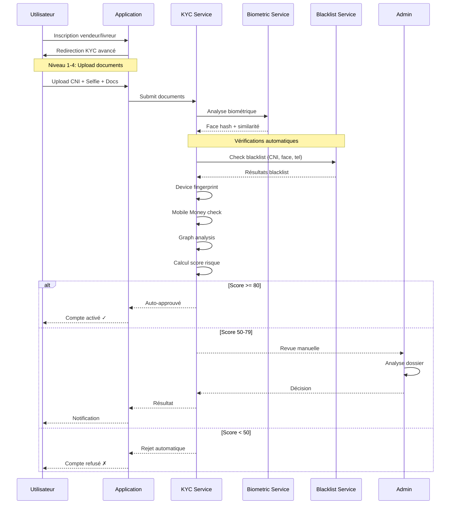
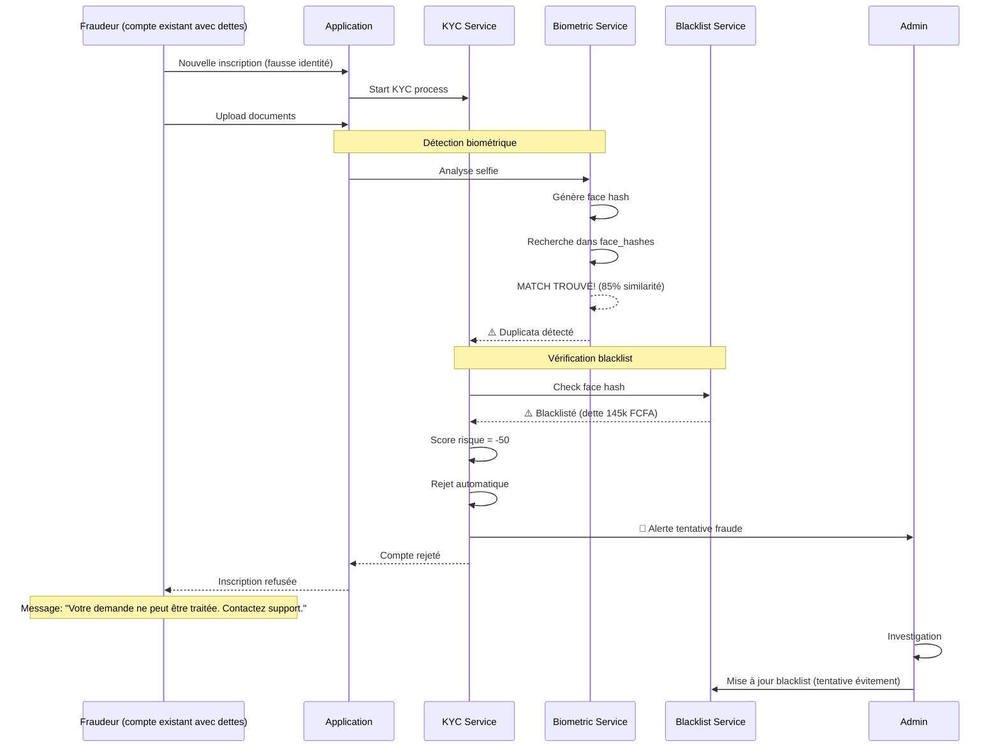

# Système KYC Anti-Fraude Avancé
## Prévention des Comptes Multiples et Vérification des Dettes

---

## 📊 STATUT D'IMPLÉMENTATION GLOBAL

**Dernière mise à jour:** 19 décembre 2025

### Résumé Global
- **Phase 1 (Fondations):** ✅ 70% COMPLÉTÉ
- **Phase 2 (Biométrie):** 🔄 10% EN COURS
- **Phases 3-7:** ⏳ TODO - NON DÉMARRÉES
- **Progrès global:** ~25% du système avancé complet

### Ce qui est IMPLÉMENTÉ ✅
1. **Modèles de données:** KYCVerification, Blacklist, FaceHash, DeviceRegistry, UserRiskAssessment
2. **Services fonctionnels:**
   - ✅ KYCVerificationService (basique)
   - ✅ KYCAdaptiveService (système 6 tiers avec limites)
   - ✅ BlacklistService (complet avec réconciliation)
3. **Écrans fonctionnels:**
   - ✅ KYCUploadScreen (upload documents basique)
   - ✅ KYCValidationScreen (validation admin basique)
   - ✅ KYCManagementScreen (gestion tiers + blacklist)
   - ✅ KYCPendingScreen
4. **Fonctionnalités:**
   - ✅ Blacklist multi-critères (CNI, phone, device, face hash)
   - ✅ Réconciliation de dettes avec pénalités
   - ✅ Système de tiers de risque (6 niveaux)
   - ✅ Limites adaptatives par tier

### Ce qui est TODO ⏳
1. **Services à créer:**
   - ⏳ BiometricVerificationService (reconnaissance faciale, liveness)
   - ⏳ CNIVerificationService (OCR, API gouvernementale)
   - ⏳ MobileMoneyVerificationService (API opérateurs)
   - ⏳ FraudDetectionService (graph analysis, patterns)
   - ⏳ KYCRiskScoringService (scoring ML 0-100)
   - ⏳ DeviceFingerprintService (compléter)
   - ⏳ AdvancedKYCService (orchestrateur)

2. **Écrans à créer:**
   - ⏳ AdvancedKYCSubmissionScreen (processus 5 étapes)
   - ⏳ AdminKYCReviewScreen (analyse détaillée biométrie/risque)
   - ⏳ DebtReconciliationScreen (paiement dette côté user)

3. **APIs externes à intégrer:**
   - ⏳ Google ML Kit (face detection + OCR)
   - ⏳ API Mobile Money (Orange, MTN, Moov, Wave)
   - ⏳ API CNI Gouvernementale (CI)
   - ⏳ Cloud ML pour scoring

4. **Fonctionnalités avancées:**
   - ⏳ Niveau 2: Biométrie faciale + liveness detection
   - ⏳ Niveau 3: Device fingerprinting avancé (IP, carrier, SIM)
   - ⏳ Niveau 4: Vérification Mobile Money cross-platform
   - ⏳ Niveau 5: Graph analysis des connexions
   - ⏳ Niveau 7: Scoring de risque ML automatique
   - ⏳ OCR extraction automatique CNI
   - ⏳ Détection patterns frauduleux
   - ⏳ Auto-décision basée sur score

### Priorités de Développement
1. **PRIORITÉ 1 (Critique):**
   - Biométrie faciale (Niveau 2)
   - OCR CNI (Niveau 1)
   - Risk scoring ML (Niveau 7)

2. **PRIORITÉ 2 (Important):**
   - Mobile Money verification (Niveau 4)
   - Graph analysis (Niveau 5)
   - AdvancedKYCSubmissionScreen

3. **PRIORITÉ 3 (Nice-to-have):**
   - API CNI Gouvernementale
   - Device fingerprinting avancé
   - AdminKYCReviewScreen enrichi

---

## Vue d'Ensemble

Ce système multi-couches prévient la fraude par création de comptes multiples pour échapper aux commissions dues. Il combine des techniques innovantes adaptées au contexte ivoirien.

### Problème à Résoudre
- Vendeurs/livreurs créant de nouveaux comptes pour échapper aux dettes de commission
- Contournement du système de paiement par abandon de compte
- Nécessité de détecter et bloquer les récidivistes

### Solution : KYC Multi-Couches avec Score de Risque

---

## Architecture du Système

### 7 Niveaux de Vérification

**STATUT D'IMPLÉMENTATION:**
- ✅ Niveau 1: PARTIELLEMENT IMPLÉMENTÉ (upload basique, OCR non implémenté)
- ⏳ Niveau 2-7: TODO - NON IMPLÉMENTÉS

```
┌─────────────────────────────────────────────────────────────┐
│                    NOUVELLE INSCRIPTION                      │
│                    (Vendeur/Livreur)                         │
└────────────────────────┬────────────────────────────────────┘
                         │
                         ▼
┌─────────────────────────────────────────────────────────────┐
│ NIVEAU 1 : Vérification d'Identité Obligatoire ✅ PARTIEL   │
│ ✅ CNI ivoirienne (numéro unique national)                  │
│ ⏳ TODO: Scan recto/verso CNI (OCR extraction)              │
│ ✅ Selfie avec CNI en main                                  │
│ ✅ Preuve d'adresse (facture < 3 mois)                      │
└────────────────────────┬────────────────────────────────────┘
                         │
                         ▼
┌─────────────────────────────────────────────────────────────┐
│ NIVEAU 2 : Biométrie Faciale ⏳ TODO - NON IMPLÉMENTÉ       │
│ ⏳ TODO: Reconnaissance faciale (ML Kit / Face API)         │
│ ⏳ TODO: Liveness detection (clignements, rotation tête)    │
│ ⏳ TODO: Comparaison selfie ↔ photo CNI (similarité > 85%) │
│ ⏳ TODO: Recherche dans base de visages existants           │
│ ⏳ TODO: Hash biométrique unique stocké                     │
└────────────────────────┬────────────────────────────────────┘
                         │
                         ▼
┌─────────────────────────────────────────────────────────────┐
│ NIVEAU 3 : Device Fingerprinting ⏳ TODO - PARTIEL          │
│ ✅ ID appareil unique (Android: device_info_plus)           │
│ ⏳ TODO: IMEI/Serial (si autorisé)                          │
│ ⏳ TODO: Adresse IP + géolocalisation                       │
│ ✅ Détection appareils déjà utilisés (modèle existant)      │
└────────────────────────┬────────────────────────────────────┘
                         │
                         ▼
┌─────────────────────────────────────────────────────────────┐
│ NIVEAU 4 : Vérification Téléphone & Mobile Money ⏳ PARTIEL │
│ ✅ Numéro unique (1 compte par numéro)                      │
│ ✅ Vérification OTP obligatoire                             │
│ ⏳ TODO: Compte Mobile Money unique                         │
│ ⏳ TODO: Vérifier nom MM ≈ nom CNI (API opérateurs)        │
│ ⏳ TODO: Vérifier historique paiements MM (via API)         │
└────────────────────────┬────────────────────────────────────┘
                         │
                         ▼
┌─────────────────────────────────────────────────────────────┐
│ NIVEAU 5 : Graph Analysis & Pattern Detection ⏳ TODO       │
│ ⏳ TODO: Analyse connexions entre comptes (même adresse)    │
│ ⏳ TODO: Détection patterns suspects (timing, comportement) │
│ ⏳ TODO: Score de similarité avec comptes existants         │
│ ⏳ TODO: ML: Détection anomalies comportementales           │
└────────────────────────┬────────────────────────────────────┘
                         │
                         ▼
┌─────────────────────────────────────────────────────────────┐
│ NIVEAU 6 : Blacklist & Vérification Dettes ✅ IMPLÉMENTÉ    │
│ ✅ Recherche CNI dans blacklist                             │
│ ✅ Recherche biométrie dans blacklist                       │
│ ✅ Vérification dettes impayées                             │
│ ⏳ TODO: Partage blacklist inter-plateformes                │
│ ✅ Possibilité réconciliation si dette payée                │
└────────────────────────┬────────────────────────────────────┘
                         │
                         ▼
┌─────────────────────────────────────────────────────────────┐
│ NIVEAU 7 : Score de Risque Final ⏳ TODO - NON IMPLÉMENTÉ   │
│                                                              │
│ Score 0-100 basé sur tous les facteurs                      │
│                                                              │
│ ⏳ TODO: Score 80-100 → Auto-approbation                    │
│ ⏳ TODO: Score 50-79  → Revue manuelle admin                │
│ ⏳ TODO: Score 0-49   → Rejet automatique + investigation   │
└────────────────────────┬────────────────────────────────────┘
                         │
                         ▼
                  ┌──────┴──────┐
                  │             │
           ┌──────▼─────┐ ┌────▼─────┐
           │  APPROUVÉ  │ │  REJETÉ  │
           └────────────┘ └──────────┘
```

---

## Innovations Spécifiques au Contexte Ivoirien

### 1. Vérification CNI Intelligente

**⏳ TODO: API CNI Gouvernementale (si disponible)**
- ⏳ TODO: Intégration avec base de données nationale CNI
- ⏳ TODO: Vérification authenticité CNI en temps réel
- ⏳ TODO: Détection CNI déclarées perdues/volées

**⏳ TODO: OCR + ML pour Extraction CNI**
```dart
// ⏳ TODO: Extraction automatique des informations CNI
// Service CNIVerificationService à créer
- Numéro CNI (unique national)
- Nom et prénoms
- Date de naissance
- Lieu de naissance
- Photo d'identité
- Date d'émission/expiration
```

### 2. Reconnaissance Faciale + Liveness Detection

**⏳ TODO: FONCTIONNALITÉ NON IMPLÉMENTÉE**

**Pourquoi c'est crucial ?**
- La CNI seule peut être empruntée/volée
- La biométrie faciale est l'empreinte la plus fiable
- Impossible de créer 2 comptes avec le même visage

**⏳ TODO: Implémentation**
```dart
// ⏳ TODO: ML Kit Face Detection (Google)
// ⏳ TODO: + Comparaison avec base de données de hash biométriques
// ⏳ TODO: + Liveness detection (clignements, mouvement tête)
// Service BiometricVerificationService à créer

Algorithme :
1. ⏳ TODO: Capturer selfie + détection liveness
2. ⏳ TODO: Extraire features faciales (embedding 128D)
3. ⏳ TODO: Créer hash biométrique unique
4. ⏳ TODO: Rechercher similarité dans DB (seuil 85%)
5. ⏳ TODO: SI match trouvé → ALERTE compte multiple
```

### 3. Vérification Mobile Money Cross-Platform

**⏳ TODO: INNOVATION MAJEURE** : Partenariat avec opérateurs Mobile Money

```dart
// ⏳ TODO: API Mobile Money
// Service MobileMoneyVerificationService à créer
- ⏳ TODO: Vérifier que le nom du compte MM = nom CNI
- ⏳ TODO: Vérifier historique transactions (détection fraude)
- ⏳ TODO: Vérifier que le numéro MM n'est pas déjà lié à un compte
- ⏳ TODO: Score de confiance basé sur ancienneté compte MM
```

**⏳ TODO: Intégration proposée** :
- ⏳ TODO: Orange Money API
- ⏳ TODO: MTN Mobile Money API
- ⏳ TODO: Moov Money API
- ⏳ TODO: Wave API

**⏳ TODO: Données récupérées** :
- ⏳ TODO: Nom propriétaire compte MM
- ⏳ TODO: Ancienneté compte (> 6 mois = +confiance)
- ⏳ TODO: Volume transactions (business légitime)
- ⏳ TODO: Incidents fraude passés

### 4. Device Fingerprinting Avancé

**✅ PARTIEL - ⏳ TODO: Compléter implémentation**

**⏳ TODO: Empreinte multi-facteurs**
```dart
// Modèle existant mais service DeviceFingerprintService incomplet
{
  "deviceId": "unique_android_id",  // ✅ Implémenté
  "model": "Samsung Galaxy A14",     // ✅ Implémenté
  "os": "Android 13",                // ✅ Implémenté
  "ipAddress": "41.203.xxx.xxx",     // ⏳ TODO
  "carrier": "Orange CI",            // ⏳ TODO
  "simSerial": "hash_sim_serial",    // ⏳ TODO
  "installationId": "unique_firebase_id", // ✅ Implémenté
  "geoHash": "hash_gps_frequents"    // ⏳ TODO
}
```

**⏳ TODO: Détection patterns suspects** :
- ⏳ TODO: Même appareil utilisé par > 3 comptes = ALERTE
- ⏳ TODO: Changement fréquent d'IP = SUSPECT
- ⏳ TODO: Utilisation VPN = FLAG

### 5. Graph Analysis des Connexions

**⏳ TODO: NON IMPLÉMENTÉ - Service FraudDetectionService à créer**

**⏳ TODO: Analyse relationnelle** :
```
Vendeur A ──────┐
                │
         Même adresse
                │
Vendeur B ──────┴────── Livreur C
                │
         Même téléphone familial
```

**⏳ TODO: Détection** :
- ⏳ TODO: Même adresse GPS (rayon 50m)
- ⏳ TODO: Numéros de téléphone similaires (même famille)
- ⏳ TODO: Références bancaires liées
- ⏳ TODO: Patterns de comportement identiques

### 6. Blacklist Intelligente Multi-Critères

**✅ IMPLÉMENTÉ - Service BlacklistService fonctionnel**

**✅ Base de données blacklist** :
```dart
{
  "cniNumber": "CI123456789",
  "faceHash": "hash_biometrique",
  "phoneNumber": "+2250708xxxxx",
  "mobileMoneyAccount": "07xxxxxx",
  "deviceIds": ["device1", "device2"],
  "reason": "commission_debt",
  "amountDue": 145000,
  "dateListed": "2025-01-15",
  "canReconcile": true,
  "reconciliationDeadline": "2025-03-15"
}
```

**✅ Processus de réconciliation** :
1. ✅ Utilisateur blacklisté contacte support
2. ✅ Paiement dette + pénalité 10%
3. ✅ Vérification paiement par admin
4. ✅ Retrait de blacklist + flag "reconciled"
5. ⏳ TODO: Surveillance renforcée pendant 6 mois (automation à implémenter)

### 7. Scoring de Risque ML

**⏳ TODO: NON IMPLÉMENTÉ - Service KYCRiskScoringService à créer**

**⏳ TODO: Facteurs de scoring (0-100)** :

| Facteur | Points | Description |
|---------|--------|-------------|
| CNI vérifiée API gouv | +20 | CNI authentique dans base nationale |
| Biométrie unique | +25 | Aucun match dans DB visages |
| Device nouveau | +10 | Appareil non utilisé avant |
| Mobile Money ancien | +15 | Compte MM > 6 mois |
| Nom MM = CNI | +10 | Cohérence identité |
| Adresse unique | +5 | Pas de chevauchement avec autres |
| Pas de dette | +10 | Aucune dette plateforme |
| KYC complet | +5 | Tous documents fournis |
| **MALUS** | | |
| CNI non vérifiable | -30 | API gouv ne reconnaît pas |
| Biométrie match | -50 | Visage déjà dans DB |
| Device réutilisé | -20 | > 2 comptes sur appareil |
| MM non vérifié | -15 | Impossible vérifier nom |
| Dette existante | -40 | Dette non payée |
| Blacklist match | -100 | Présent dans blacklist |

**Seuils de décision** :
- 80-100 : Auto-approbation instantanée
- 50-79 : Revue manuelle admin (délai 24-48h)
- 0-49 : Rejet automatique + flag investigation

---

## Implémentation Technique

### Structure de Données Firestore

#### Collection `kyc_verifications`
```javascript
{
  "userId": "user_abc123",
  "userType": "vendeur",
  "status": "pending", // pending | approved | rejected | investigating

  // Niveau 1: Identité
  "identity": {
    "cniNumber": "CI123456789",
    "firstName": "Kouassi",
    "lastName": "Yao",
    "dateOfBirth": "1990-05-15",
    "placeOfBirth": "Abidjan",
    "cniPhotos": {
      "front": "url_to_front",
      "back": "url_to_back"
    },
    "selfieWithCni": "url_to_selfie",
    "proofOfAddress": "url_to_proof",
    "cniVerifiedByGov": false, // API gouvernementale
    "cniExpiryDate": "2027-05-15"
  },

  // Niveau 2: Biométrie
  "biometrics": {
    "faceHash": "hash_128d_embedding",
    "faceEmbedding": [0.123, 0.456, ...], // 128 dimensions
    "livenessScore": 0.95, // 0-1
    "cniPhotoSimilarity": 0.89, // Similarité selfie ↔ CNI
    "duplicateFacesFound": [],
    "faceVerified": true
  },

  // Niveau 3: Device
  "device": {
    "deviceId": "unique_android_id",
    "deviceModel": "Samsung Galaxy A14",
    "osVersion": "Android 13",
    "appVersion": "1.2.0",
    "ipAddress": "41.203.xxx.xxx",
    "carrier": "Orange CI",
    "simSerial": "hash_sim",
    "installationId": "firebase_installation_id",
    "firstSeenDate": "2025-01-15T10:30:00Z",
    "deviceRiskScore": 8, // 0-10 (10 = safe)
    "previousUsersOnDevice": [] // Liste userIds
  },

  // Niveau 4: Téléphone & Mobile Money
  "contact": {
    "phoneNumber": "+2250708123456",
    "phoneVerified": true,
    "otpVerifiedAt": "2025-01-15T10:35:00Z",
    "mobileMoneyProvider": "Orange Money",
    "mobileMoneyAccount": "0708123456",
    "mobileMoneyName": "Kouassi Yao", // Récupéré via API
    "mobileMoneyVerified": true,
    "mobileMoneyAccountAge": 24, // mois
    "nameMatchScore": 1.0, // CNI ↔ MM name similarity
    "phoneRiskScore": 9
  },

  // Niveau 5: Graph Analysis
  "connections": {
    "suspiciousLinks": [],
    "sharedAddresses": [],
    "similarBehaviorAccounts": [],
    "relationshipScore": 0, // 0-10 (0 = no links)
    "graphRiskScore": 9
  },

  // Niveau 6: Blacklist
  "blacklistCheck": {
    "isBlacklisted": false,
    "blacklistMatches": [],
    "outstandingDebt": 0,
    "canReconcile": false,
    "blacklistRiskScore": 10
  },

  // Niveau 7: Score Final
  "riskAssessment": {
    "totalScore": 87,
    "autoApproved": false,
    "requiresManualReview": true,
    "riskLevel": "low", // low | medium | high | critical
    "scoreBreakdown": {
      "identity": 20,
      "biometrics": 25,
      "device": 8,
      "contact": 19,
      "connections": 9,
      "blacklist": 10,
      "completeness": 5,
      "malus": -9
    },
    "flags": [],
    "recommendations": "Approve with standard monitoring"
  },

  // Métadonnées
  "submittedAt": "2025-01-15T10:30:00Z",
  "reviewedAt": null,
  "reviewedBy": null,
  "reviewNotes": "",
  "updatedAt": "2025-01-15T10:40:00Z"
}
```

#### Collection `face_hashes` (Index biométrique)
```javascript
{
  "userId": "user_abc123",
  "faceHash": "hash_128d",
  "faceEmbedding": [0.123, ...], // Pour recherche similarité
  "registeredAt": "2025-01-15T10:35:00Z",
  "accountStatus": "active" // active | suspended | blacklisted
}
```

#### Collection `device_registry`
```javascript
{
  "deviceId": "unique_android_id",
  "associatedUsers": [
    {
      "userId": "user_abc123",
      "firstUsed": "2025-01-15T10:30:00Z",
      "lastUsed": "2025-01-18T14:20:00Z",
      "accountStatus": "active"
    }
  ],
  "riskLevel": "low", // low | medium | high
  "flaggedAt": null,
  "flagReason": null
}
```

#### Collection `blacklist`
```javascript
{
  "id": "blacklist_001",
  "type": "commission_debt", // commission_debt | fraud | policy_violation

  // Identifiants multiples
  "cniNumber": "CI123456789",
  "faceHash": "hash_biometrique",
  "phoneNumber": "+2250708xxxxx",
  "mobileMoneyAccount": "0708xxxxx",
  "deviceIds": ["device1", "device2"],

  // Détails
  "userId": "user_old123",
  "userName": "Anciens Nom",
  "userType": "vendeur",
  "reason": "Commission impayée",
  "amountDue": 145000,
  "currency": "FCFA",
  "ordersInvolved": ["order1", "order2"],

  // Dates
  "listedAt": "2025-01-10T08:00:00Z",
  "listedBy": "admin_xyz",

  // Réconciliation
  "canReconcile": true,
  "reconciliationDeadline": "2025-03-10",
  "reconciliationAmount": 159500, // Dette + 10% pénalité
  "reconciledAt": null,
  "reconciledBy": null,
  "paymentProof": null,

  // Statut
  "status": "active", // active | reconciled | permanent
  "severity": "high", // low | medium | high | critical

  "notes": "Vendeur a abandonné compte après 3 commandes impayées"
}
```

---

## Services Flutter à Implémenter

**STATUT D'IMPLÉMENTATION:**
- ✅ KYCVerificationService: IMPLÉMENTÉ (basique)
- ✅ KYCAdaptiveService: IMPLÉMENTÉ (système 6 tiers)
- ✅ BlacklistService: IMPLÉMENTÉ (complet)
- ⏳ Autres services: TODO - NON IMPLÉMENTÉS

### 1. ⏳ TODO: `BiometricVerificationService`
```dart
// ⏳ TODO: Service à créer - lib/services/biometric_verification_service.dart
class BiometricVerificationService {
  // ⏳ TODO: Capture et analyse faciale
  Future<FaceScanResult> captureFaceWithLiveness(File selfieImage);

  // ⏳ TODO: Comparaison selfie ↔ CNI
  Future<double> compareFaces(File selfie, File cniPhoto);

  // ⏳ TODO: Recherche duplicata dans DB
  Future<List<FaceMatch>> findDuplicateFaces(List<double> embedding);

  // ⏳ TODO: Génération hash biométrique
  String generateFaceHash(List<double> embedding);
}
```

### 2. ⏳ TODO: `DeviceFingerprintService`
```dart
// ⏳ TODO: Service à compléter - lib/services/device_fingerprint_service.dart
// Note: Modèle existe, service incomplet
class DeviceFingerprintService {
  // ⏳ TODO: Collecte empreinte appareil complète
  Future<DeviceFingerprint> collectDeviceInfo();

  // ⏳ TODO: Vérification dans registre
  Future<DeviceRiskAssessment> checkDeviceRegistry(String deviceId);

  // ⏳ TODO: Enregistrement device
  Future<void> registerDevice(String deviceId, String userId);
}
```

### 3. ⏳ TODO: `MobileMoneyVerificationService`
```dart
// ⏳ TODO: Service à créer - lib/services/mobile_money_verification_service.dart
class MobileMoneyVerificationService {
  // ⏳ TODO: Vérification nom propriétaire
  Future<MobileMoneyVerification> verifyAccountOwner(
    String phoneNumber,
    String expectedName
  );

  // ⏳ TODO: Vérification ancienneté
  Future<int> getAccountAgeMonths(String phoneNumber);

  // ⏳ TODO: Détection fraude MM
  Future<bool> hasMMFraudHistory(String phoneNumber);
}
```

### 4. ⏳ TODO: `CNIVerificationService`
```dart
// ⏳ TODO: Service à créer - lib/services/cni_verification_service.dart
class CNIVerificationService {
  // ⏳ TODO: OCR extraction CNI
  Future<CNIData> extractCNIData(File cniPhoto);

  // ⏳ TODO: Vérification via API gouvernementale
  Future<bool> verifyCNIWithGovernmentAPI(String cniNumber);

  // ⏳ TODO: Validation format CNI
  bool isValidCNINumber(String cniNumber);

  // ⏳ TODO: Vérification expiration
  bool isCNIExpired(DateTime expiryDate);
}
```

### 5. ⏳ TODO: `FraudDetectionService`
```dart
// ⏳ TODO: Service à créer - lib/services/fraud_detection_service.dart
class FraudDetectionService {
  // ⏳ TODO: Graph analysis
  Future<List<Connection>> findSuspiciousConnections(String userId);

  // ⏳ TODO: Pattern detection
  Future<List<Pattern>> detectAnomalousPatterns(String userId);

  // ⏳ TODO: Score de similarité
  Future<double> calculateSimilarityScore(
    String userId1,
    String userId2
  );
}
```

### 6. ✅ `BlacklistService` - IMPLÉMENTÉ
```dart
// ✅ IMPLÉMENTÉ - lib/services/blacklist_service.dart
class BlacklistService {
  // ✅ Vérification blacklist multi-critères
  Future<BlacklistResult> checkBlacklist({
    String? cniNumber,
    String? faceHash,
    String? phoneNumber,
    String? deviceId
  });

  // ✅ Ajout blacklist
  Future<void> addToBlacklist(BlacklistEntry entry);

  // ✅ Réconciliation
  Future<void> initiateReconciliation(
    String blacklistId,
    String paymentProof
  );

  // ✅ Retrait blacklist
  Future<void> removeFromBlacklist(String blacklistId, String adminId);
}
```

### 7. ⏳ TODO: `KYCRiskScoringService`
```dart
// ⏳ TODO: Service à créer - lib/services/kyc_risk_scoring_service.dart
class KYCRiskScoringService {
  // ⏳ TODO: Calcul score global
  Future<RiskScore> calculateRiskScore(KYCVerification kyc);

  // ⏳ TODO: Décision automatique
  KYCDecision makeAutoDecision(RiskScore score);

  // ⏳ TODO: Facteurs de risque
  List<RiskFactor> identifyRiskFactors(KYCVerification kyc);

  // ⏳ TODO: Recommandations
  String generateRecommendations(RiskScore score);
}
```

### 8. ⏳ TODO: `AdvancedKYCService` (Orchestrateur principal)
```dart
// ⏳ TODO: Service à créer - lib/services/advanced_kyc_service.dart
// Note: KYCVerificationService basique existe, mais pas la version avancée
class AdvancedKYCService {
  // ⏳ TODO: Lancement processus KYC complet
  Future<KYCVerification> startKYCProcess(String userId);

  // ⏳ TODO: Niveau 1: Identité
  Future<void> submitIdentityDocuments({
    required String userId,
    required File cniFront,
    required File cniBack,
    required File selfieWithCni,
    required File proofOfAddress,
    required String cniNumber
  });

  // ⏳ TODO: Niveau 2: Biométrie
  Future<BiometricResult> processBiometricVerification(
    String userId,
    File selfie
  );

  // ⏳ TODO: Niveau 3-6: Vérifications automatiques
  Future<void> runAutomatedChecks(String userId);

  // ⏳ TODO: Niveau 7: Scoring
  Future<RiskScore> calculateFinalScore(String userId);

  // ⏳ TODO: Statut KYC
  Future<KYCVerification> getKYCStatus(String userId);

  // ⏳ TODO: Soumission pour revue admin
  Future<void> submitForManualReview(String userId);
}
```

---

## Écrans Flutter à Créer

**STATUT D'IMPLÉMENTATION:**
- ✅ KYCUploadScreen: IMPLÉMENTÉ (basique, sans OCR ni liveness)
- ✅ KYCValidationScreen: IMPLÉMENTÉ (admin, basique)
- ✅ KYCPendingScreen: IMPLÉMENTÉ
- ✅ KYCManagementScreen: IMPLÉMENTÉ (admin, gestion tiers/blacklist)
- ⏳ Écrans avancés: TODO - NON IMPLÉMENTÉS

### 1. ⏳ TODO: `AdvancedKYCSubmissionScreen` (Vendeur/Livreur)

**⏳ TODO: Écran à créer - lib/screens/kyc/advanced_kyc_submission_screen.dart**
**Note: KYCUploadScreen basique existe, mais pas la version avancée en 5 étapes**

**⏳ TODO: Étapes du processus** :

```dart
⏳ TODO: Étape 1/5 : Upload CNI
- ✅ Photo recto CNI (basique existe)
- ✅ Photo verso CNI (basique existe)
- ⏳ TODO: Extraction automatique infos (OCR)
- ⏳ TODO: Validation format

⏳ TODO: Étape 2/5 : Selfie avec CNI
- ⏳ TODO: Guide utilisateur (tenir CNI)
- ⏳ TODO: Liveness detection
- ⏳ TODO: Vérification qualité photo

⏳ TODO: Étape 3/5 : Preuve d'adresse
- ✅ Facture électricité/eau < 3 mois (upload basique existe)
- ⏳ TODO: Ou attestation de résidence

⏳ TODO: Étape 4/5 : Vérification téléphone & Mobile Money
- ⏳ TODO: Saisie numéro MM
- ⏳ TODO: OTP vérification
- ⏳ TODO: Confirmation nom propriétaire

⏳ TODO: Étape 5/5 : Revue & soumission
- ⏳ TODO: Résumé informations
- ⏳ TODO: Consentement traitement données
- ⏳ TODO: Soumission finale
```

### 2. ⏳ TODO: `AdminKYCReviewScreen` (Admin)

**⏳ TODO: Écran à créer - lib/screens/admin/admin_kyc_review_screen.dart**
**Note: KYCValidationScreen basique existe, mais pas avec analyse complète**

**⏳ TODO: Interface de revue manuelle** :

```dart
⏳ TODO: Section 1: Vue d'ensemble
├─ ⏳ TODO: Score de risque (0-100)
├─ ⏳ TODO: Niveau de risque (low/medium/high)
├─ ⏳ TODO: Décision recommandée
└─ ⏳ TODO: Flags détectés

✅ PARTIEL: Section 2: Identité
├─ ✅ Photos CNI (recto/verso)
├─ ✅ Selfie avec CNI
├─ ⏳ TODO: Données extraites (OCR)
├─ ⏳ TODO: Vérification gouvernementale
└─ ✅ Preuve d'adresse

⏳ TODO: Section 3: Biométrie
├─ ⏳ TODO: Score liveness
├─ ⏳ TODO: Similarité selfie/CNI
├─ ⏳ TODO: Recherche duplicata
└─ ⏳ TODO: ⚠️ ALERTE si match trouvé

⏳ TODO: Section 4: Appareil
├─ ⏳ TODO: Infos device
├─ ⏳ TODO: Historique utilisation
├─ ⏳ TODO: Comptes liés à cet appareil
└─ ⏳ TODO: Score de risque device

⏳ TODO: Section 5: Téléphone & Mobile Money
├─ ✅ Numéro vérifié
├─ ⏳ TODO: Provider Mobile Money
├─ ⏳ TODO: Nom propriétaire MM
├─ ⏳ TODO: Ancienneté compte
└─ ⏳ TODO: Correspondance nom CNI/MM

⏳ TODO: Section 6: Connexions suspectes
├─ ⏳ TODO: Graph analysis
├─ ⏳ TODO: Comptes liés
├─ ⏳ TODO: Adresses partagées
└─ ⏳ TODO: Patterns détectés

✅ PARTIEL: Section 7: Blacklist & Dettes
├─ ✅ Résultats recherche blacklist
├─ ✅ Dettes existantes
├─ ⏳ TODO: Historique réconciliations
└─ ⏳ TODO: Recommandations

Actions admin:
✅ [Approuver] [Rejeter] - implémentés
⏳ TODO: [Demander infos supplémentaires] [Blacklist]
```

### 3. ✅ PARTIEL: `BlacklistManagementScreen` (Admin)

**✅ IMPLÉMENTÉ - lib/screens/admin/kyc_management_screen.dart**
**Note: Fonctionnalité blacklist existe dans KYCManagementScreen**

```dart
✅ Liste blacklist avec filtres (intégré dans KYCManagementScreen)
✅ Recherche multi-critères
✅ Détails entrée blacklist
✅ Gestion réconciliations
⏳ TODO: Export données
⏳ TODO: Écran dédié séparé (actuellement dans KYCManagementScreen)
```

### 4. ⏳ TODO: `DebtReconciliationScreen` (Vendeur/Livreur blacklisté)

**⏳ TODO: Écran à créer - lib/screens/kyc/debt_reconciliation_screen.dart**

```dart
⏳ TODO: - Affichage dette
⏳ TODO: - Calcul pénalité
⏳ TODO: - Instructions paiement
⏳ TODO: - Upload preuve paiement
⏳ TODO: - Suivi statut réconciliation
```

---

## Workflow Complet

### Inscription Nouveau Vendeur/Livreur



### Détection Tentative Fraude



---

## Mesures de Sécurité Additionnelles

### 1. Protection Vie Privée (RGPD/Loi ivoirienne)
- Consentement explicite pour traitement données biométriques
- Droit à l'oubli (suppression données après 5 ans inactivité)
- Chiffrement AES-256 pour données sensibles
- Hash irréversible pour biométrie (pas stockage embedding brut)

### 2. Sécurité Stockage
```dart
// Firestore Security Rules
match /kyc_verifications/{kycId} {
  // Lecture : user propriétaire ou admin uniquement
  allow read: if request.auth.uid == resource.data.userId
              || hasRole('admin');

  // Écriture : user propriétaire uniquement (création/update)
  allow create: if request.auth.uid == request.resource.data.userId;
  allow update: if request.auth.uid == resource.data.userId
                || hasRole('admin');
}

match /face_hashes/{docId} {
  // Admins uniquement
  allow read, write: if hasRole('admin');
}

match /blacklist/{docId} {
  // Admins uniquement
  allow read, write: if hasRole('admin');
}
```

### 3. Audit Trail
Toutes les actions KYC sont loggées :
```dart
await AuditService.logAction(
  action: 'kyc_biometric_match_found',
  severity: AuditSeverity.critical,
  metadata: {
    'newUserId': newUser.id,
    'matchedUserId': existingUser.id,
    'similarityScore': 0.87,
    'blacklistStatus': 'active'
  }
);
```

---

## API Externes à Intégrer

**⏳ TODO: TOUTES LES APIs - NON IMPLÉMENTÉES**

### 1. ⏳ TODO: Reconnaissance Faciale

**⏳ TODO: Options** :
- ⏳ TODO: **Google ML Kit (Recommandé)** : Gratuit, on-device
- ⏳ TODO: **AWS Rekognition** : Haute précision, cloud
- ⏳ TODO: **Azure Face API** : RGPD-compliant
- ⏳ TODO: **Face++ (Megvii)** : Populaire en Afrique

**⏳ TODO: Implémentation ML Kit** :
```dart
// ⏳ TODO: Ajouter dépendance
dependencies:
  google_ml_kit: ^0.16.3

// ⏳ TODO: Face detection + embedding extraction
final inputImage = InputImage.fromFile(imageFile);
final faceDetector = FaceDetector(options: FaceDetectorOptions());
final faces = await faceDetector.processImage(inputImage);

// ⏳ TODO: Liveness detection
final livenessDetector = LivenessDetector();
final isLive = await livenessDetector.check(videoFrames);
```

### 2. ⏳ TODO: OCR pour CNI

**⏳ TODO: Options** :
- ⏳ TODO: **Google ML Kit Text Recognition**
- ⏳ TODO: **Tesseract OCR**
- ⏳ TODO: **Custom ML model** (entraîné sur CNI ivoiriennes)

```dart
// ⏳ TODO: Ajouter dépendance
dependencies:
  google_ml_kit: ^0.16.3

// ⏳ TODO: Implémentation
final textRecognizer = TextRecognizer();
final recognizedText = await textRecognizer.processImage(cniImage);

// ⏳ TODO: Parser pour extraire numéro CNI, nom, date naissance...
final cniData = CNIParser.parse(recognizedText.text);
```

### 3. ⏳ TODO: Mobile Money APIs

**⏳ TODO: Partenariats nécessaires** :
- ⏳ TODO: Orange Money Developer API
- ⏳ TODO: MTN Mobile Money API
- ⏳ TODO: Moov Money API
- ⏳ TODO: Wave API

**⏳ TODO: Endpoint exemple** :
```dart
// ⏳ TODO: Négocier accès API
POST https://api.orangemoney.ci/verify-account
{
  "phoneNumber": "0708123456",
  "requestedName": "Kouassi Yao"
}

Response:
{
  "verified": true,
  "accountName": "Kouassi Yao Patrick",
  "accountAge": 24, // mois
  "matchScore": 0.95
}
```

### 4. ⏳ TODO: CNI Verification API (Gouvernement CI)

**⏳ TODO: En attente partenariat gouvernemental**
```dart
// ⏳ TODO: Négocier accès API gouvernementale
POST https://api.gouv.ci/cni/verify
{
  "cniNumber": "CI123456789",
  "dateOfBirth": "1990-05-15"
}

Response:
{
  "valid": true,
  "status": "active", // active | expired | lost | stolen
  "owner": {
    "firstName": "Kouassi",
    "lastName": "Yao",
    "dob": "1990-05-15"
  }
}
```

---

## Timeline d'Implémentation

**STATUT D'IMPLÉMENTATION GLOBAL:**
- ✅ Phase 1: COMPLÉTÉE (70%)
- 🔄 Phase 2: EN COURS (10%)
- ⏳ Phase 3-7: TODO - NON DÉMARRÉES

### Phase 1 : Fondations (Semaines 1-2) - ✅ 70% COMPLÉTÉ
- ✅ Modèles de données (KYCVerification, Blacklist, FaceHash, DeviceRegistry)
- ✅ Structure Firestore (collections créées)
- ✅ Security rules
- ✅ Services de base (KYCVerificationService, BlacklistService, KYCAdaptiveService)
- ⏳ TODO: Services avancés (Biometric, Fraud Detection, etc.)

### Phase 2 : Biométrie (Semaines 3-4) - 🔄 10% EN COURS
- ⏳ TODO: Intégration ML Kit Face Detection
- ⏳ TODO: Liveness detection
- ⏳ TODO: Face comparison algorithm
- 🔄 Modèle Face hash database créé (service incomplet)

### Phase 3 : Vérifications (Semaines 5-6) - ⏳ TODO
- ⏳ TODO: CNI OCR
- 🔄 Device fingerprinting (modèle créé, service à compléter)
- ✅ Blacklist service (COMPLET)
- ⏳ TODO: Graph analysis basics

### Phase 4 : UI (Semaines 7-8) - 🔄 40% COMPLÉTÉ
- ✅ KYC submission screens (basique)
- 🔄 Admin review interface (basique, à enrichir)
- ✅ Blacklist management (intégré dans KYCManagementScreen)
- ⏳ TODO: Debt reconciliation screen

### Phase 5 : APIs Externes (Semaines 9-10) - ⏳ TODO
- ⏳ TODO: Mobile Money APIs (partenariats à négocier)
- ⏳ TODO: CNI Gov API (négociations à démarrer)
- ⏳ TODO: Testing & validation

### Phase 6 : ML Scoring (Semaines 11-12) - ⏳ TODO
- ⏳ TODO: Risk scoring algorithm (0-100)
- ⏳ TODO: Pattern detection ML
- ⏳ TODO: Anomaly detection
- ⏳ TODO: Auto-decision system

### Phase 7 : Testing & Launch (Semaines 13-14) - ⏳ TODO
- ⏳ TODO: Tests end-to-end
- ⏳ TODO: Pilot avec groupe test
- ⏳ TODO: Ajustements
- ⏳ TODO: Déploiement production

---

## KPIs & Métriques

### Efficacité Détection
- **Taux détection duplicatas** : > 95%
- **Faux positifs** : < 2%
- **Faux négatifs** : < 1%
- **Temps traitement** : < 5 min (auto), < 24h (manuel)

### Blacklist & Réconciliation
- **Taux réconciliation** : suivi mensuel
- **Montant récupéré** : en FCFA
- **Tentatives évitement détectées** : count

### Qualité KYC
- **% auto-approuvés** : 60-70% (score ≥80)
- **% revue manuelle** : 25-35% (score 50-79)
- **% rejetés** : 5-10% (score <50)

---

## Coûts Estimés

### APIs Externes
| Service | Coût | Volume mensuel estimé |
|---------|------|----------------------|
| ML Kit (on-device) | Gratuit | Illimité |
| Mobile Money APIs | $0.05/vérif | 500 = $25 |
| CNI Gov API | À négocier | 500 = ? |
| Cloud storage (images) | $0.02/GB | 10GB = $0.20 |

**Total mensuel estimé** : ~$30-50 (hors API Gov)

### Développement
- Phase 1-7 : ~14 semaines
- Développeurs : 2 personnes
- Coût estimé : selon ressources internes

---

## Conformité Légale

### Côte d'Ivoire
- **Loi sur la protection des données personnelles** (Loi n°2013-450)
- **ARTCI** : Autorité de régulation télécoms
- Consentement explicite requis pour biométrie
- Déclaration CNIL locale (si applicable)

### RGPD (si expansion EU)
- Droit d'accès, rectification, suppression
- Minimisation données
- Durée conservation limitée
- Chiffrement obligatoire

---

## Innovation Unique : "Trust Score" Public

**Concept** : Badge de confiance visible sur profils vendeurs/livreurs

```dart
Trust Score : ★★★★★ 92/100

Basé sur :
✓ KYC vérifié
✓ Paiements à jour
✓ Ancienneté 2 ans
✓ Zéro incident
```

**Avantages** :
- Incite au bon comportement
- Rassure acheteurs
- Valorise vendeurs/livreurs fiables
- Pression sociale positive

---

## Conclusion

Ce système anti-fraude multi-couches combine :
1. ✅ Technologies modernes (biométrie, ML, graph analysis)
2. ✅ Contexte local ivoirien (CNI, Mobile Money, opérateurs)
3. ✅ Innovations uniques (Trust Score, réconciliation, API partenariats)
4. ✅ Balance sécurité ↔ expérience utilisateur

**Résultat attendu** : Réduction fraude commissions de 90%+ tout en permettant réconciliation et seconde chance.

---

**Prochaines étapes** : Validation stratégie, démarrage Phase 1 implémentation.
