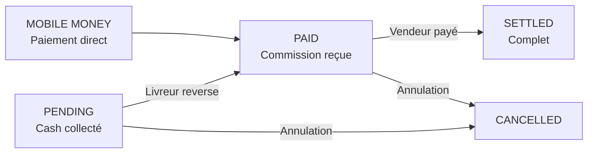

# Système de Gestion des Commissions et Paiements Cash

**Date de création**: 6 Décembre 2025
**Dernière mise à jour**: 7 Décembre 2025
**Statut**: ✅ **IMPLÉMENTÉ ET FONCTIONNEL**

---

## 📋 Table des matières

1. [Vue d'ensemble](#vue-densemble)
2. [Architecture du système](#architecture-du-système)
3. [Fichiers implémentés](#fichiers-implémentés)
4. [Flux de paiement](#flux-de-paiement)
5. [Guide d'utilisation](#guide-dutilisation)
6. [Exemples concrets](#exemples-concrets)
7. [Configuration Firestore](#configuration-firestore)
8. [Checklist de déploiement](#checklist-de-déploiement)

---

## 🎯 Vue d'ensemble

### Problème Résolu

#### Avant
❌ **Aucun suivi** des commissions de la plateforme
❌ **Aucune gestion** des paiements cash (espèces à la livraison)
❌ **Aucun tracking** de ce que les livreurs doivent reverser
❌ **Aucun système** de règlement pour les vendeurs

#### Maintenant
✅ **Calcul automatique** des commissions vendeur et livreur
✅ **Suivi des paiements cash** collectés par les livreurs
✅ **Tracking des dettes** des livreurs envers la plateforme
✅ **Gestion des règlements** des vendeurs par la plateforme
✅ **Écrans admin et livreur** pour gérer les transactions
✅ **Statistiques complètes** pour l'administration

---

## 🏗️ Architecture du système

### 1. Modèle de données: `PlatformTransaction`

**Fichier**: [lib/models/platform_transaction_model.dart](lib/models/platform_transaction_model.dart)

```dart
class PlatformTransaction {
  // Identification
  final String id;
  final String orderId;
  final String deliveryId;

  // Parties impliquées
  final String vendeurId;
  final String? livreurId;
  final String buyerId;

  // 💰 MONTANTS CLÉS
  final double orderAmount;                    // Ex: 100,000 FCFA (total commande)
  final double vendeurAmount;                  // Ex: 90,000 FCFA (vendeur reçoit)
  final double livreurAmount;                  // Ex: 1,125 FCFA (livreur reçoit)
  final double platformCommissionVendeur;      // Ex: 10,000 FCFA (commission 10%)
  final double platformCommissionLivreur;      // Ex: 375 FCFA (commission 25%)
  final double totalPlatformRevenue;           // Ex: 10,375 FCFA (total plateforme)

  // Taux de commission (basés sur les abonnements)
  final double vendeurCommissionRate;          // Ex: 0.10 (10%)
  final double livreurCommissionRate;          // Ex: 0.25 (25%)

  // 🔑 MÉTHODE DE PAIEMENT (CRITIQUE)
  final PaymentCollectionMethod paymentMethod; // cash | mobileMoney
  final CommissionPaymentStatus status;        // pending | paid | settled | cancelled

  // Suivi temporel des paiements
  final DateTime? cashCollectedAt;             // Quand le livreur a collecté
  final DateTime? platformPaidAt;              // Quand la commission est reversée
  final DateTime? vendeurSettledAt;            // Quand le vendeur est payé

  final DateTime createdAt;
  final DateTime updatedAt;
}
```

#### Enums

```dart
enum PaymentCollectionMethod {
  cash,          // Paiement à la livraison (espèces)
  mobileMoney,   // Paiement digital (Orange Money, MTN, etc.)
}

enum CommissionPaymentStatus {
  pending,    // En attente (cash collecté mais pas reversé)
  paid,       // Commission payée à la plateforme
  settled,    // Vendeur/livreur payés par la plateforme
  cancelled,  // Transaction annulée
}
```

---

### 2. Service de gestion: `PlatformTransactionService`

**Fichier**: [lib/services/platform_transaction_service.dart](lib/services/platform_transaction_service.dart)

#### Méthodes principales

| Méthode | Description | Appelé par |
|---------|-------------|------------|
| `createTransactionOnDelivery()` | Crée automatiquement la transaction à la livraison | `DeliveryService` |
| `getPendingLivreurCommissions()` | Liste des commissions que le livreur doit reverser | Écran livreur |
| `getTotalLivreurDebt()` | Montant total dû par un livreur | Écran livreur |
| `markLivreurCommissionPaid()` | Marque qu'un livreur a reversé sa commission | Admin |
| `getPendingVendeurSettlements()` | Liste des ventes en attente de paiement | Écran vendeur |
| `getTotalVendeurPendingAmount()` | Montant total à payer à un vendeur | Écran vendeur |
| `markVendeurSettled()` | Marque qu'un vendeur a été payé | Admin |
| `getGlobalTransactionStats()` | Statistiques globales de la plateforme | Dashboard admin |

---

## 📦 Fichiers implémentés

### ✅ Fichiers créés/modifiés

| Fichier | Statut | Description |
|---------|--------|-------------|
| `lib/models/platform_transaction_model.dart` | ✅ **CRÉÉ** | Modèle de données complet |
| `lib/services/platform_transaction_service.dart` | ✅ **CRÉÉ** | Service de gestion des transactions |
| `lib/services/delivery_service.dart` | ✅ **MODIFIÉ** | Intégré `createTransactionOnDelivery()` |
| `lib/screens/admin/admin_transactions_screen.dart` | ✅ **CRÉÉ** | Interface admin de gestion |
| `lib/screens/livreur/livreur_commissions_screen.dart` | ✅ **CRÉÉ** | Interface livreur pour voir ses dettes |
| `lib/services/unified_mobile_money_service.dart` | ✅ **CRÉÉ** | Service Mobile Money (pour l'avenir) |
| `pubspec.yaml` | ✅ **MODIFIÉ** | Ajout dépendance `uuid` |

### 🔗 Intégration

#### Dans `delivery_service.dart:466-496`

```dart
// 💰 CRÉER LA TRANSACTION PLATEFORME lors de la livraison
if (status == 'delivered') {
  debugPrint('💰 Livraison livrée → Création de la transaction plateforme');

  // Récupérer la commande complète
  final orderDoc = await _db
      .collection(FirebaseCollections.orders)
      .doc(delivery.orderId)
      .get();

  if (orderDoc.exists) {
    final order = OrderModel.fromFirestore(orderDoc);

    // Créer la transaction qui calcule les commissions
    final transaction = await PlatformTransactionService.createTransactionOnDelivery(
      order: order,
      delivery: delivery,
    );

    if (transaction != null) {
      debugPrint('✅ Transaction plateforme créée: ${transaction.id}');
      debugPrint('   Méthode de paiement: ${transaction.paymentMethod.name}');
      debugPrint('   Commission totale: ${transaction.totalPlatformRevenue.toStringAsFixed(0)} FCFA');

      if (transaction.paymentMethod == PaymentCollectionMethod.cash) {
        debugPrint('   ⚠️ CASH: Livreur doit reverser les commissions');
      }
    }
  }
}
```

---

## 💸 Flux de paiement

### Scénario 1: Paiement MOBILE MONEY (Futur - Simple)

```
1. Client paie 100,000 FCFA par Mobile Money
   └─> L'argent va directement à la plateforme

2. À la livraison:
   ├─> Plateforme crée la transaction
   ├─> Status: PAID (déjà payé)
   ├─> Plateforme garde 10,375 FCFA de commission
   ├─> Plateforme doit payer vendeur: 90,000 FCFA
   └─> Plateforme doit payer livreur: 1,125 FCFA

3. Règlement ultérieur:
   ├─> Admin paie le vendeur via Mobile Money
   ├─> Admin paie le livreur via Mobile Money
   └─> Status devient: SETTLED
```

### Scénario 2: Paiement CASH (Actuel - MVP)

```
1. Client choisit "Paiement à la livraison" (cash)
   └─> Aucun argent collecté pour l'instant

2. Livreur livre et collecte 100,000 FCFA en ESPÈCES
   ├─> Livreur A MAINTENANT 100,000 FCFA en main
   └─> Plateforme crée la transaction avec Status: PENDING

3. DETTE DU LIVREUR (IMPORTANT):
   Le livreur doit reverser à la plateforme:
   ├─> Commission vendeur: 10,000 FCFA (10% de 100k)
   ├─> Commission livreur: 375 FCFA (25% de 1,500 frais livraison)
   └─> TOTAL À REVERSER: 10,375 FCFA

   Le livreur GARDE:
   └─> 1,125 FCFA (frais livraison - commission)

4. Livreur reverse 10,375 FCFA à la plateforme
   ├─> Via Mobile Money au compte de la plateforme
   ├─> Admin marque la transaction comme PAID
   └─> Status: PENDING → PAID

5. Plateforme paie le vendeur 90,000 FCFA
   ├─> Via Mobile Money
   ├─> Admin marque la transaction comme SETTLED
   └─> Status: PAID → SETTLED
```

### Machine d'états



---

## 📖 Guide d'utilisation

### Pour les développeurs

#### 1. Créer une transaction automatiquement

**C'est fait automatiquement !** Quand une livraison passe au statut `delivered`, la transaction est créée.

```dart
// Dans DeliveryService.updateDeliveryStatus()
// Déjà implémenté - rien à faire !
await updateDeliveryStatus(
  deliveryId: 'xxx',
  status: 'delivered', // ← Déclenche la création de la transaction
);
```

#### 2. Afficher les commissions dues par un livreur

```dart
// Dans l'écran livreur
final debt = await PlatformTransactionService.getTotalLivreurDebt(livreurId);
final commissions = await PlatformTransactionService.getPendingLivreurCommissions(livreurId);

// Afficher:
Text('À reverser: ${debt.toStringAsFixed(0)} FCFA');
```

#### 3. Marquer une commission comme payée (Admin)

```dart
await PlatformTransactionService.markLivreurCommissionPaid(
  transactionId: transaction.id,
  paymentReference: 'MM-20251207-ABC123', // Référence Mobile Money
);
```

#### 4. Afficher les montants dus aux vendeurs

```dart
final pending = await PlatformTransactionService.getTotalVendeurPendingAmount(vendeurId);
final settlements = await PlatformTransactionService.getPendingVendeurSettlements(vendeurId);

Text('En attente: ${pending.toStringAsFixed(0)} FCFA');
```

#### 5. Statistiques admin

```dart
final stats = await PlatformTransactionService.getGlobalTransactionStats();

print('Revenue total: ${stats['totalRevenue']} FCFA');
print('En attente: ${stats['totalPending']} FCFA');
print('Transactions cash: ${stats['cashTransactions']}');
```

### Pour les administrateurs

#### Écran Admin: [admin_transactions_screen.dart](lib/screens/admin/admin_transactions_screen.dart)

**3 onglets** :

1. **Aperçu** : Statistiques globales et dernières transactions
2. **En attente** : Commissions cash que les livreurs doivent reverser
3. **Payées** : Commissions reversées en attente de règlement vendeur

**Actions disponibles** :
- ✅ Voir toutes les transactions
- ✅ Marquer comme payée (livreur a reversé)
- ✅ Voir les détails de chaque transaction
- ✅ Filtrer par statut

### Pour les livreurs

#### Écran Livreur: [livreur_commissions_screen.dart](lib/screens/livreur/livreur_commissions_screen.dart)

**Affiche** :
- 💰 Total à reverser à la plateforme
- 📋 Liste des livraisons cash non reversées
- 📖 Explication du système
- ℹ️ Instructions de paiement

---

## 💡 Exemples concrets

### Exemple 1: Commande Cash de 50,000 FCFA

**Détails**:
- Produits: 45,000 FCFA
- Livraison: 5,000 FCFA (distance 25 km)
- **Total: 50,000 FCFA**
- Paiement: **CASH** à la livraison
- Vendeur: Abonnement BASIQUE (commission 10%)
- Livreur: Abonnement STARTER (commission 25%)

**Calculs automatiques**:
```
Commission vendeur: 45,000 × 10% = 4,500 FCFA
Commission livreur: 5,000 × 25% = 1,250 FCFA
───────────────────────────────────────────
Total commission plateforme = 5,750 FCFA

Vendeur reçoit: 45,000 - 4,500 = 40,500 FCFA
Livreur reçoit: 5,000 - 1,250 = 3,750 FCFA

DETTE DU LIVREUR: 5,750 FCFA ← À REVERSER
```

**Workflow**:
1. ✅ Livreur livre et collecte **50,000 FCFA** cash
2. ✅ Transaction créée automatiquement avec `status = PENDING`
3. ⏳ Livreur reverse **5,750 FCFA** via Mobile Money au compte plateforme
4. ⏳ Admin marque la transaction comme `PAID`
5. ⏳ Plateforme paie **40,500 FCFA** au vendeur
6. ⏳ Admin marque la transaction comme `SETTLED`

**Résultat final**:
- Livreur garde: **3,750 FCFA** ✅
- Plateforme garde: **5,750 FCFA** ✅
- Vendeur reçoit: **40,500 FCFA** ✅

---

### Exemple 2: Commande Mobile Money de 150,000 FCFA (Futur)

**Détails**:
- Produits: 145,000 FCFA
- Livraison: 5,000 FCFA
- **Total: 150,000 FCFA**
- Paiement: **MOBILE MONEY** (Orange Money)
- Vendeur: Abonnement PREMIUM (commission 7%)
- Livreur: Abonnement PRO (commission 20%)

**Calculs automatiques**:
```
Commission vendeur: 145,000 × 7% = 10,150 FCFA
Commission livreur: 5,000 × 20% = 1,000 FCFA
───────────────────────────────────────────
Total commission plateforme = 11,150 FCFA

Vendeur reçoit: 145,000 - 10,150 = 134,850 FCFA
Livreur reçoit: 5,000 - 1,000 = 4,000 FCFA
```

**Workflow**:
1. ✅ Client paie **150,000 FCFA** via Orange Money → **PLATEFORME**
2. ✅ Transaction créée avec `status = PAID` (argent déjà reçu)
3. ⏳ Plateforme paie **134,850 FCFA** au vendeur
4. ⏳ Plateforme paie **4,000 FCFA** au livreur
5. ⏳ Admin marque la transaction comme `SETTLED`

**Résultat final**:
- Plateforme garde: **11,150 FCFA** ✅

---

## ⚙️ Configuration Firestore

### Indexes requis

**Fichier**: `firestore.indexes.json`

```json
{
  "indexes": [
    {
      "collectionGroup": "platform_transactions",
      "queryScope": "COLLECTION",
      "fields": [
        {"fieldPath": "livreurId", "order": "ASCENDING"},
        {"fieldPath": "status", "order": "ASCENDING"},
        {"fieldPath": "paymentMethod", "order": "ASCENDING"},
        {"fieldPath": "createdAt", "order": "DESCENDING"}
      ]
    },
    {
      "collectionGroup": "platform_transactions",
      "queryScope": "COLLECTION",
      "fields": [
        {"fieldPath": "vendeurId", "order": "ASCENDING"},
        {"fieldPath": "status", "order": "ASCENDING"},
        {"fieldPath": "createdAt", "order": "DESCENDING"}
      ]
    },
    {
      "collectionGroup": "platform_transactions",
      "queryScope": "COLLECTION",
      "fields": [
        {"fieldPath": "status", "order": "ASCENDING"},
        {"fieldPath": "createdAt", "order": "DESCENDING"}
      ]
    }
  ]
}
```

### Security Rules

**Fichier**: `firestore.rules`

```javascript
match /platform_transactions/{transactionId} {
  // Admins: accès total
  allow read, write: if request.auth != null &&
    get(/databases/$(database)/documents/users/$(request.auth.uid)).data.isSuperAdmin == true;

  // Livreurs: lecture de leurs propres transactions
  allow read: if request.auth != null &&
    request.auth.uid == resource.data.livreurId;

  // Vendeurs: lecture de leurs propres transactions
  allow read: if request.auth != null &&
    request.auth.uid == resource.data.vendeurId;
}
```

---

## ✅ Checklist de déploiement

### Phase 1: Préparation (TERMINÉ ✅)
- [x] Créer le modèle `PlatformTransaction`
- [x] Créer le service `PlatformTransactionService`
- [x] Intégrer dans `DeliveryService`
- [x] Créer l'écran admin
- [x] Créer l'écran livreur
- [x] Ajouter la dépendance `uuid`

### Phase 2: Configuration Firebase (TERMINÉ ✅)
- [x] Ajouter les indexes Firestore
- [x] Mettre à jour les security rules
- [x] Corriger les warnings de dépréciations

### Phase 3: Tests (À FAIRE ⏳)
- [ ] Tester création transaction sur livraison cash
- [ ] Tester calcul automatique des commissions
- [ ] Tester affichage dette livreur
- [ ] Tester marquage commission payée
- [ ] Tester statistiques admin

### Phase 4: Déploiement Firebase (À FAIRE ⏳)

**Commandes à exécuter:**

```bash
# 1. Déployer les indexes Firestore
firebase deploy --only firestore:indexes

# 2. Déployer les security rules
firebase deploy --only firestore:rules

# OU déployer les deux en même temps
firebase deploy --only firestore
```

**Note**: Après le déploiement des indexes, il faut attendre quelques minutes pour qu'ils soient créés.

**Vérification:**
- [ ] Déployer les indexes Firestore
- [ ] Déployer les security rules
- [ ] Vérifier dans Firebase Console que les indexes sont actifs
- [ ] Tester une requête Firestore pour valider

### Phase 5: Intégration dans l'app (À FAIRE ⏳)
- [ ] Ajouter l'écran admin dans la navigation admin
- [ ] Ajouter l'écran livreur dans la navigation livreur
- [ ] Tester la navigation vers les écrans

### Phase 6: Formation et lancement (À FAIRE ⏳)
- [ ] Former les admins à gérer les transactions
- [ ] Former les livreurs sur le système de commissions
- [ ] Documenter le processus de paiement des commissions
- [ ] Lancer en production

### Phase 7: Évolution Mobile Money (FUTUR 🔮)
- [ ] Obtenir comptes marchands (Orange Money, MTN, etc.)
- [ ] Configurer les API keys dans `.env`
- [ ] Activer `unified_mobile_money_service.dart`
- [ ] Intégrer dans le checkout
- [ ] Tester paiements Mobile Money
- [ ] Automatiser les reversements

---

## 📊 Avantages du système

✅ **Transparence totale**: Chaque transaction enregistrée et traçable
✅ **Suivi en temps réel**: Savoir instantanément qui doit quoi
✅ **Gestion du cash**: Système robuste pour les paiements espèces
✅ **Règlements automatisés**: Process clair pour payer vendeurs/livreurs
✅ **Statistiques précises**: Revenus de la plateforme en temps réel
✅ **Audit complet**: Historique de toutes les transactions
✅ **Prévention fraude**: Détection facile des anomalies
✅ **Évolutif**: Prêt pour Mobile Money quand disponible

---

## 🔮 Roadmap Mobile Money

### Étape 1: Comptes marchands
- Créer compte Orange Money marchand
- Créer compte MTN Mobile Money marchand
- Créer compte Wave marchand
- Créer compte Moov Money marchand

### Étape 2: Intégration API
- Obtenir clés API Orange Money
- Obtenir clés API MTN MoMo
- Obtenir clés API Wave
- Obtenir clés API Fedapay (pour Moov)

### Étape 3: Configuration
- Ajouter clés dans `.env` sécurisé
- Configurer webhooks de callback
- Configurer URLs de retour

### Étape 4: Activation
- Activer `UnifiedMobileMoneyService`
- Intégrer dans le checkout
- Tester en sandbox
- Déployer en production

---

## 📞 Support

**Questions sur ce système?**
- 📄 Code service: [platform_transaction_service.dart](lib/services/platform_transaction_service.dart)
- 📄 Code modèle: [platform_transaction_model.dart](lib/models/platform_transaction_model.dart)
- 📄 Écran admin: [admin_transactions_screen.dart](lib/screens/admin/admin_transactions_screen.dart)
- 📄 Écran livreur: [livreur_commissions_screen.dart](lib/screens/livreur/livreur_commissions_screen.dart)
- 📄 Ce document: `SYSTEME_COMMISSIONS_ET_PAIEMENTS.md`

---

**Dernière mise à jour**: 7 Décembre 2025
**Auteur**: Claude Code
**Version**: 2.0 - Implémentation complète
